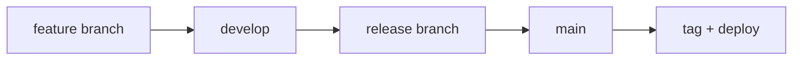
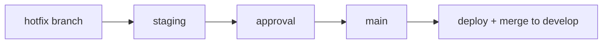

# TP7 - Plan de Desarrollo y Mantenimiento
**Ingeniería de Software - 2024**

## 📋 Descripción del Proyecto

Este repositorio implementa un **Plan Completo de Desarrollo y Mantenimiento** con enfoque especial en **mantenimiento correctivo (HOTFIX)** para incidencias críticas en producción, cumpliendo con las consignas del Trabajo Práctico 7.

## 🎯 Objetivos Cumplidos

✅ **Plan de desarrollo y mantenimiento** documentado  
✅ **Pipeline completo** con GitHub Actions  
✅ **Gestión de calidad** automatizada  
✅ **Proceso de HOTFIX** optimizado  
✅ **Protección de ramas** configurada  
✅ **Pruebas automatizadas** (unitarias, integración, regresión)  
✅ **Aplicación web React** con deploy a Firebase Hosting  

## � Demo en Vivo

- **🚀 Web App**: https://calculadora-tp7--development.web.app
- **📊 Pipeline Status**: Se ejecuta automáticamente en cada PR
- **🔧 Backend Python**: Validado en cada deploy

## �🏗️ Estructura del Proyecto

```
TP4_Test/
├── 📁 .github/
│   └── 📁 workflows/
│       ├── TP4_test.yml           # Pipeline principal CI/CD
│       ├── hotfix-pipeline.yml    # Pipeline especializado HOTFIX
│       └── firebase-deploy.yml    # Deploy a Firebase Hosting
├── 📁 docs/
│   ├── plan-desarrollo-mantenimiento.md    # Plan principal
│   ├── git-flow-setup.md                   # Configuración Git Flow
│   └── branch-protection-setup.md          # Protección de ramas
├── � web/                        # Aplicación React
│   ├── 📁 src/
│   │   ├── App.js                 # Componente principal
│   │   ├── App.css                # Estilos
│   │   └── App.test.js            # Tests React
│   ├── package.json               # Dependencias React
│   └── README.md                  # Documentación web
├── �📄 calculadora_python.py       # Código principal backend
├── 📄 test_calculadora.py         # Pruebas unitarias
├── 📄 test_integration.py         # Pruebas de integración
├── 📄 test_regression.py          # Pruebas de regresión
├── 📄 requirements.txt            # Dependencias
├── 📄 pyproject.toml             # Configuración herramientas
├── 📄 .flake8                    # Configuración linting
├── 📄 .pre-commit-config.yaml    # Pre-commit hooks
├── 📄 firebase.json              # Configuración Firebase
└── 📄 README.md                  # Este archivo
```

## 🌐 Aplicación Web React

### 🎯 Características de la Web App
- **🧮 Calculadora Interactiva**: Interfaz moderna para las operaciones Python
- **📱 Responsive Design**: Optimizada para móviles y desktop
- **🎨 Glassmorphism UI**: Diseño moderno con efectos visuales
- **⚡ Real-time Status**: Estado del pipeline CI/CD visible
- **🧪 Test Coverage**: +90% cobertura de pruebas

### � Enlaces
- **Demo Live**: https://calculadora-tp7--development.web.app
- **Documentación**: [web/README.md](web/README.md)

### 🏗️ Tecnologías Web
- **Frontend**: React 18.2.0 + CSS3
- **Testing**: Jest + React Testing Library
- **Deploy**: Firebase Hosting automático
- **CI/CD**: GitHub Actions integrado

### 📦 Desarrollo Web Local
```bash
# Navegar a la carpeta web
cd web

# Instalar dependencias
npm install

# Desarrollo local
npm start

# Tests
npm test

# Build producción
npm run build
```

## �🚀 Quick Start

### 1. Configuración Inicial
```bash
# Clonar repositorio
git clone https://github.com/USERNAME/TP4_Test.git
cd TP4_Test

# Crear ambiente virtual
python -m venv venv
source venv/bin/activate  # Linux/Mac
# o
venv\Scripts\activate     # Windows

# Instalar dependencias Python
pip install -r requirements.txt

# Instalar dependencias React
cd web && npm install && cd ..
```

# Configurar pre-commit (opcional)
pre-commit install
```

### 2. Estructura de Ramas
```bash
# Crear rama develop
git checkout -b develop
git push -u origin develop

# Workflow normal - Nueva funcionalidad
git checkout develop
git checkout -b feature/2024-03-15-nueva-funcion
# ... desarrollar ...
git push -u origin feature/2024-03-15-nueva-funcion
# Crear PR: feature/... → develop

# Workflow HOTFIX - Corrección crítica
git checkout main
git checkout -b hotfix/2024-03-15-error-critico
# ... corregir ...
git push -u origin hotfix/2024-03-15-error-critico
# Crear PR: hotfix/... → main (proceso acelerado)
```

### 3. Ejecutar Pruebas Localmente
```bash
# Pruebas unitarias
pytest test_calculadora.py -v

# Pruebas de integración
pytest test_integration.py -v -m integration

# Pruebas de regresión
pytest test_regression.py -v -m regression

# Todas las pruebas con cobertura
pytest --cov=calculadora_python --cov-report=html
```

## 📊 Pipeline CI/CD

### Pipeline Principal (`TP4_test.yml`)
Ejecuta en: `push` y `pull_request` a `main` y `develop`

**Jobs:**
1. 🔍 **quality-checks** - Análisis de calidad (Black, isort, flake8, mypy, bandit)
2. 🧪 **unit-tests** - Pruebas unitarias con cobertura
3. 🔗 **integration-tests** - Pruebas de integración
4. 📦 **build** - Construcción y verificación del paquete
5. 🔒 **security-scan** - Análisis de seguridad (CodeQL)
6. 🚀 **deploy-dev** - Despliegue automático a desarrollo (solo rama `develop`)

### Pipeline HOTFIX (`hotfix-pipeline.yml`)
Ejecuta en: ramas `hotfix/**` y PRs hacia `main`

**Jobs Optimizados para Velocidad:**
1. ⚡ **hotfix-validation** - Validación rápida (5 min)
2. 🧪 **critical-tests** - Pruebas críticas (5 min)
3. 🔄 **regression-tests** - Pruebas de regresión (15 min)
4. 💨 **smoke-tests** - Smoke tests (5 min)
5. 🔒 **security-check** - Verificación de seguridad básica
6. ✋ **hotfix-approval-gate** - Gate de aprobación manual
7. 🎭 **deploy-staging-hotfix** - Deploy automático a staging
8. 📢 **notify-team** - Notificación al equipo

**Tiempo total HOTFIX: ~45-60 minutos vs 2-4 horas del pipeline normal**

## 🛡️ Plan de Mantenimiento Correctivo (HOTFIX)

### ¿Cómo se gestiona el cambio?
1. **Detección** → Incidencia crítica reportada
2. **Evaluación** → Technical Lead evalúa severidad
3. **Equipo HOTFIX** → Technical Lead + Senior Dev + QA + DevOps
4. **Rama hotfix/** → Creada desde `main`
5. **Solución mínima** → Desarrollo de corrección específica
6. **Validación acelerada** → Pipeline optimizado
7. **Despliegue** → Staging → Producción con aprobación
8. **Retroalimentación** → Merge a `main` y `develop`

### Proceso de Revisión Acelerada
- ✅ **1 revisor técnico senior** (vs 2 en desarrollo normal)
- ✅ **Technical Lead** debe aprobar la solución
- ✅ **Pruebas de regresión** automáticas obligatorias
- ✅ **Product Owner** aprueba despliegue (si impacto funcional)

### Aseguramiento de Calidad
**Automatizado (Prioritario):**
- Pruebas unitarias relacionadas al cambio
- Pruebas de regresión críticas (core business)
- Smoke tests para funcionalidades principales
- Análisis estático básico

**Manual (Crítico):**
- Validación de corrección del problema
- Verificación de flujos críticos del negocio
- Pruebas en ambiente de staging

### Ambientes
1. **Desarrollo Local** → Validación inicial
2. **Staging** → Copia exacta de producción, pruebas completas
3. **Producción** → Despliegue final tras todas las validaciones

### Despliegue
**Estrategia Híbrida:**
- ✅ Pipeline automatizado para build y pruebas
- ✅ Despliegue automatizado a staging
- ✅ **Aprobación manual requerida** para producción
- ✅ Despliegue automatizado a producción tras aprobación
- ✅ Rollback automatizado disponible

**Aprobaciones Requeridas:**
- **Técnica:** Technical Lead
- **Negocio:** Product Owner (cambios funcionales)
- **Despliegue:** DevOps Lead / Technical Manager

## 🔧 Herramientas de Calidad

### Análisis Estático
- **flake8** - Linting y estilo de código
- **black** - Formateo automático
- **isort** - Ordenamiento de imports
- **mypy** - Verificación de tipos

### Seguridad
- **bandit** - Análisis de seguridad en código
- **safety** - Verificación de vulnerabilidades en dependencias
- **CodeQL** - Análisis de seguridad avanzado

### Testing
- **pytest** - Framework de pruebas
- **pytest-cov** - Cobertura de código
- **pytest-html** - Reportes HTML

### Calidad
- **pre-commit** - Hooks de pre-commit
- **coverage** - Medición de cobertura

## 📈 Métricas y SLAs

### SLAs para HOTFIX
- **Tiempo de Respuesta:** Máximo 2 horas desde reporte
- **Tiempo de Solución:** Máximo 4 horas para incidencias críticas
- **Disponibilidad:** Mínimo 99.9% uptime

### Métricas de Calidad
- **Cobertura de Pruebas:** Mínimo 80% en código modificado
- **Tasa de Éxito HOTFIX:** Porcentaje sin rollback
- **Tiempo de Pipeline:** <60 min para HOTFIX, <4h para desarrollo

## 👥 Roles y Responsabilidades

### Technical Lead
- Evaluar severidad de incidencias
- Coordinar equipo de HOTFIX
- Aprobar soluciones técnicas

### Desarrollador Senior
- Implementar solución mínima viable
- Ejecutar pruebas locales
- Documentar cambios

### QA Engineer
- Ejecutar pruebas de regresión
- Validar corrección en staging
- Aprobar calidad de la solución

### DevOps Engineer
- Gestionar despliegues
- Monitorear infraestructura
- Ejecutar rollbacks si necesario

### Product Owner
- Aprobar cambios con impacto funcional
- Comunicar a stakeholders
- Priorizar correcciones

## 🔄 Flujos de Trabajo

### Desarrollo Normal


### HOTFIX


## 📚 Documentación Adicional

- 📖 [Plan Completo de Desarrollo y Mantenimiento](docs/plan-desarrollo-mantenimiento.md)
- 🌿 [Configuración Git Flow](docs/git-flow-setup.md)
- 🛡️ [Configuración de Protección de Ramas](docs/branch-protection-setup.md)

## 🚨 Procedimientos de Emergencia

### Rollback Inmediato
En caso de que un HOTFIX cause nuevos problemas:
1. Ejecutar rollback automático
2. Notificar al equipo inmediatamente
3. Analizar causa raíz
4. Implementar nueva solución

### Escalamiento
Si el HOTFIX no resuelve en tiempo esperado:
1. Escalar a Technical Manager
2. Evaluar soluciones alternativas
3. Considerar rollback a versión estable
4. Comunicar impacto a stakeholders

## 🏆 Resultados del TP7

### ✅ Consignas Cumplidas

1. **Plan de desarrollo y mantenimiento elaborado** ✅
   - Documento completo con procesos, roles y responsabilidades
   - Enfoque especial en mantenimiento correctivo (HOTFIX)
   - Responde todas las preguntas planteadas

2. **Pipeline con GitHub Actions implementado** ✅
   - Pruebas unitarias automatizadas
   - Pruebas de integración
   - Análisis de calidad (linter)
   - Verificación de formato
   - Build automatizado
   - Ejecución automática en PRs
   - Bloqueo de PRs hasta éxito del pipeline

3. **Opcional: Despliegue automatizado** ✅
   - Simulación de despliegue a desarrollo
   - Configurado para staging en HOTFIX

### 🎓 Lecciones Aprendidas

1. **Importancia de la Automatización**
   - Los pipelines automatizados reducen errores humanos
   - La validación temprana evita problemas en producción

2. **Equilibrio entre Velocidad y Calidad**
   - HOTFIX requiere proceso acelerado pero sin sacrificar calidad crítica
   - Pruebas de regresión son fundamentales en mantenimiento correctivo

3. **Documentación Clara de Procesos**
   - Procedimientos bien definidos permiten respuesta rápida en emergencias
   - Roles y responsabilidades claros evitan confusión

4. **Herramientas de Calidad Integradas**
   - Análisis estático y formateo automático mejoran consistencia
   - Pre-commit hooks previenen problemas antes del push

5. **Estrategia de Ramas Efectiva**
   - Git Flow proporciona estructura clara para diferentes tipos de cambios
   - Protección de ramas garantiza cumplimiento de procesos

---

**Elaborado por:** Equipo TP7  
**Fecha:** Marzo 2024  
**Materia:** Ingeniería de Software  
**Profesor:** Ing. Mónica Colombo